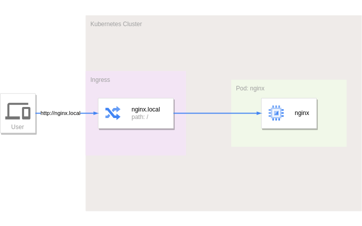
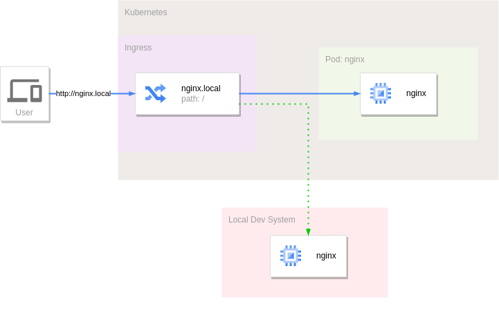
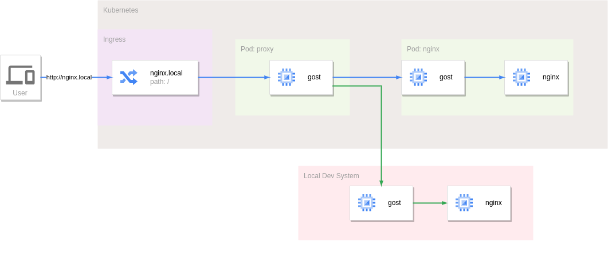
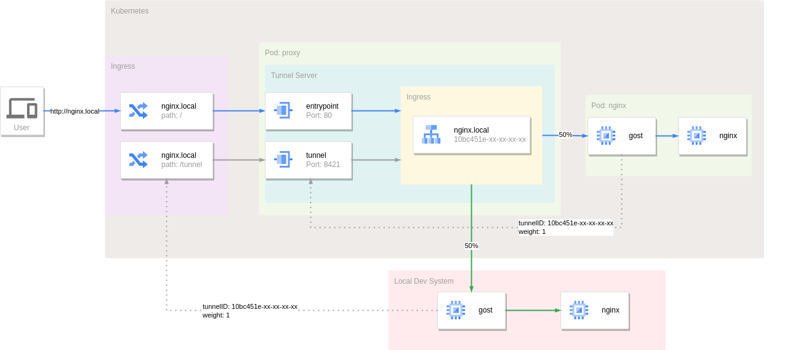

---
authors:
  - ginuerzh
categories:
  - Reverse Proxy
readtime: 15
date: 2024-01-29
comments: true
---

# 利用反向代理隧道实现k8s中服务的本地调试

当前的容器，Kubernetes等云原生技术使我们的服务部署和管理更加灵活和便利，然而任何技术有利就会有弊，当一个应用运行在Kubernetes集群中时，如果需要对其进行调试则会很麻烦。

目前比较主流的解决方案是使用[Telepresence](https://www.telepresence.io/)等工具，将服务的流量拦截并转发到本地服务，从而实现本地环境下的开发和调试。下面我们将利用[反向代理隧道](https://gost.run/tutorials/reverse-proxy-tunnel/)来实现类似的功能。

<!-- more -->

假设我们在集群中运行了一个Nginx服务(如下图)，通过Ingress定义的主机名`nginx.local`来访问，如果集群的入口IP地址为192.168.1.1，那么就可以通过以下命令来直接访问到此Nginx服务：

```bash
curl --resolve nginx.local:80:192.168.1.1 http://nginx.local
```



如果想在本地开发环境中调试此服务，所需要做的和Telepresence一样，把Ingress进入集群到Nginx服务的流量拦截并转发到本地运行的Nginx服务，也就是流量分流。



反向代理隧道即是一个反向代理，同时又具备隧道转发的功能，将进入反向代理的流量通过隧道转发到对端。具体的思路是在Nginx服务的前面运行一个反向代理隧道服务接管原本发给Nginx服务的所有流量，Nginx服务所在的Pod中通过Sidecar方式运行反向代理隧道客户端，通过隧道连接到反向代理隧道服务。默认情况下所有流量会通过此隧道转发给集群中的Nginx服务。

反向代理隧道支持单个隧道的高可用性，单个隧道可以对应多个客户端连接，因此只需要在本地开发环境中再运行一个反向代理隧道客户端以相同的隧道ID接入集群中的反向代理隧道服务，流量就会被分流到本地。



具体的配置如下：

```yaml
apiVersion: v1
kind: Service
metadata:
  name: proxy
spec:
  selector:
    app: proxy
  ports:
    - name: tunnel
      protocol: TCP
      port: 8421
      targetPort: tunnel
    - name: entrypoint
      protocol: TCP
      port: 80
      targetPort: entrypoint
---
apiVersion: apps/v1
kind: Deployment
metadata:
  name: proxy
spec:
  replicas: 1
  selector:
    matchLabels:
      app: proxy
  template:
    metadata:
      name: proxy
      labels:
        app: proxy
    spec:
      restartPolicy: Always
      containers:
        - name: gost
          image: gogost/gost
          args:
            - "-L"
            - "tunnel+ws://:8421?entrypoint=:80&tunnel=nginx.local:10bc451e-59dc-4c70-999e-91a30813ac78&path=/proxy"
          ports:
            - name: tunnel
              containerPort: 8421
              protocol: TCP
            - name: entrypoint
              containerPort: 80
              protocol: TCP
          resources:
            limits:
              cpu: 1000m
              memory: 1000Mi
            requests:
              cpu: 10m
              memory: 10Mi
  strategy:
    type: RollingUpdate
    rollingUpdate:
      maxUnavailable: 0
      maxSurge: 1
  minReadySeconds: 10
---
apiVersion: apps/v1
kind: Deployment
metadata:
  name: nginx
spec:
  replicas: 1
  selector:
    matchLabels:
      app: nginx
  template:
    metadata:
      name: nginx
      labels:
        app: nginx
    spec:
      restartPolicy: Always
      containers:
        - name: gost
          image: gogost/gost
          args:
            - "-L"
            - "rtcp://:0/:80"
            - "-F"
            - "tunnel+ws://proxy:8421?tunnel.id=10bc451e-59dc-4c70-999e-91a30813ac78&tunnel.weight=1&path=/proxy"
          resources:
            limits:
              cpu: 1000m
              memory: 1000Mi
            requests:
              cpu: 10m
              memory: 10Mi
        - name: nginx
          image: nginx:alpine
          resources:
            limits:
              cpu: 1000m
              memory: 1000Mi
            requests:
              cpu: 10m
              memory: 10Mi
  strategy:
    type: RollingUpdate
    rollingUpdate:
      maxUnavailable: 0
      maxSurge: 1
  minReadySeconds: 10
---
apiVersion: networking.k8s.io/v1
kind: Ingress
metadata:
  name: nginx
spec:
  rules:
    - host: nginx.local
      http:
        paths:
          - path: /
            pathType: Prefix
            backend:
              service:
                name: proxy
                port:
                  name: entrypoint
          - path: /proxy
            pathType: Prefix
            backend:
              service:
                name: proxy
                port:
                  name: tunnel
```

反向代理隧道服务定义了两个端口：`entrypoint` - 外部流量的入口点：80，`tunnel` - 隧道客户端入口：8421。

由于采用的是Websocket协议，因此外部的隧道客户端可以和正常的流量一样通过Ingress由指定的`/proxy`路径连接到隧道服务。此时在本地只需要执行以下命令就会将流量分流到本地的Nginx服务中。

```bash
gost -L rtcp://:0/:80 -F "tunnel+ws://192.168.1.1:80?tunnel.id=10bc451e-59dc-4c70-999e-91a30813ac78&tunnel.weight=1&path=/proxy&host=nginx.local"
```



注意隧道客户端的`weight`参数，通过此参数可以指定隧道连接的权重。当一个隧道有多个客户端连接时，隧道服务端将采取加权随机方式来选择客户端，权重值越大的连接被选中的几率越高，权重值的范围是[1,255]。在上面的例子中两个客户端的权重都为1，因此转发到每个客户端的流量均为50%。

当权重值为`255`时，其他权重值小于255的客户端将被排除，流量仅会转发给权重值为255的客户端，通过这个机制可以拦截所有流量到本地。


## 小结

以上便是利用反向代理隧道帮助集群服务本地调试的整个流程。相比于Telepresence有以下优缺点：

优点：

* 简单，对系统的侵入性较低。相较于Telepresence的VPN模式，反向代理隧道并不会将集群网络完全暴露出来，而是对需要的流量通过正常的Ingress入口进行分流转发。

* 动态无缝流量切换。二者都是使用Sidecar模式，Telepresence是在需要分流时将Agent服务动态注入到被拦截的Pod中，虽然很便利，但也会导致服务重启。反向代理隧道是通过提前注入隧道客户端，分流由隧道服务端动态完成，对被拦截的服务没有任何影响。

* 对本地系统没有限制。Telepresence由于要运行Daemon服务，所以需要root权限，而反向代理隧道客户端无任何要求。

缺点：

* 功能单一。反向代理隧道仅能对流量进行拦截和转发，而Telepresence可以将流量，环境变量，Secret，ConfigMap，甚至文件系统都映射到本地。

* 调用集群中的服务困难。反向代理隧道并未完全接入集群网络，因此无法像在集群内部一样直接访问其他服务。

* 无法精确分流。Telepresence的[Personal intercept](https://www.getambassador.io/docs/telepresence/latest/concepts/intercepts#personal-intercept)，可以用来更加精准的对流量进行分流，而反向代理隧道目前还无法做到。