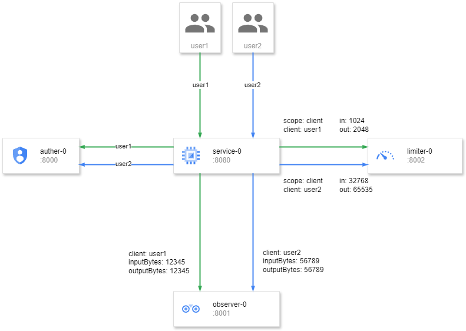

---
authors:
  - ginuerzh
categories:
  - Limiter
  - Observer
readtime: 10
date: 2024-09-04
comments: true
---

# 用户级别的流量统计和动态限流方案

GOST中的[观测器](https://gost.run/concepts/observer/)组件可以用来对服务的连接和流量进行统计，当服务配置使用了观测器，则会周期性以事件(Event)的方式上报此服务的接收(inputBytes)和发送数据(outputBytes)总字节数。而[限制器](https://gost.run/concepts/limiter/)组件则可以用来限制服务的连接和流量。

有些时候可能需要对流量进行更加精细化管理。例如一个支持认证的代理服务，需要按用户进行流量统计或限速，更进一步可能还需要根据用户的实时流量来做动态限流。由于不同的使用场景可能会有比较复杂的处理逻辑，为了获得更高的灵活性和更强的扩展性，GOST本身并没有提供用户级别的限流功能，而是通过插件的方式开放给使用者来实现自己的逻辑。

<!-- more -->

对于支持认证的处理器(HTTP，HTTP2，SOCKS4，SOCKS5，Relay)，观测器和流量限制器可以用在这些处理器上，再结合[认证器](https://gost.run/concepts/auth/)组件，就可以实现比较灵活的用户级别动态限流功能。

对于处理器上的观测器，会根据认证器返回的用户标识对流量进行分组统计并上报，通过观测器插件就可以得到用户级别的流量信息。对于处理器上的流量限制器，也会根据认证器返回的用户标识向插件请求用户级别的限流配置。流量限制器插件也可以选择结合观测器接收到的用户流量统计信息来动态调整单个用户的限速配置。




```yaml
services:
  - name: service-0
    addr: :8080
    handler:
      type: http
      auther: auther-0
      observer: observer-0
      limiter: limiter-0
    listener:
      type: tcp
authers:
  - name: auther-0
    plugin:
      type: http
      addr: http://localhost:8000/auther
observers:
  - name: observer-0
    plugin:
      type: http
      addr: http://localhost:8001/observer
limiters:
  - name: limiter-0
    plugin:
      type: http
      addr: http://localhost:8002/limiter
```