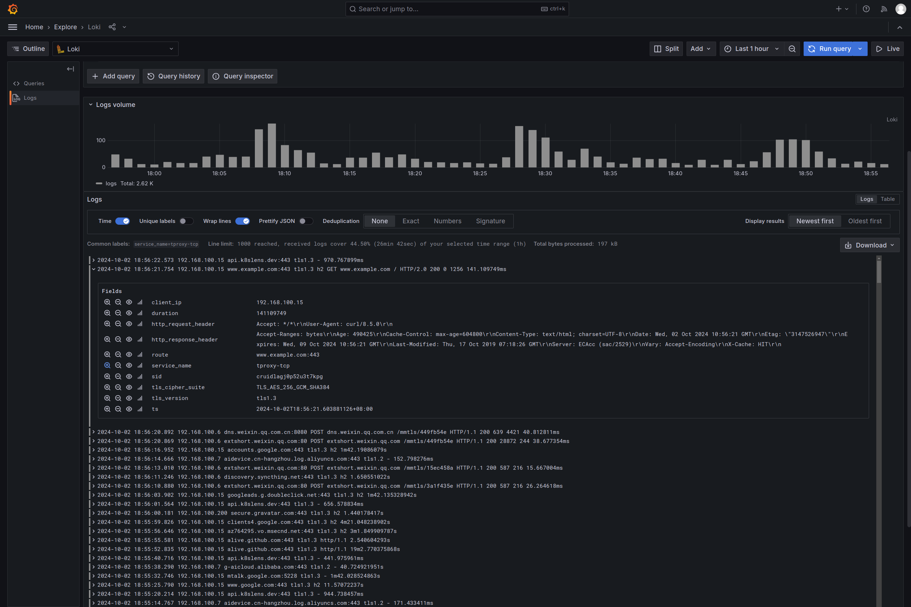
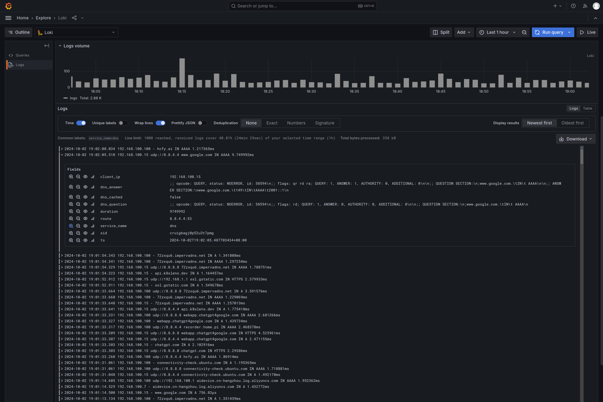

---
authors:
  - ginuerzh
categories:
  - Logging
readtime: 10
date: 2024-09-16
comments: true
---

# GOST中的日志

程序运行的日志无论是对开发人员还是使用人员都是一个很重要且很有价值的信息。对于开发人员可以帮助其快速定位问题，对于使用人员一方面在遇到问题时可以将日志提供给开发人员方便分析和定位问题，另一方面通过日志可以对应用的使用情况进行统计和分析。日志也是[可观测性](https://opentelemetry.io/zh/docs/concepts/observability-primer/)概念的组成部分，日志让我们多了一个观测和监控程序运行状态和行为的手段。

<!-- more -->

## 通用日志

GOST中的[日志模块](https://gost.run/tutorials/log/)会记录不同等级的运行信息，主要包括基本的连接信息(INFO)，流量路由信息(DEBUG)，和更详细的请求/响应信息(TRACE)。大多数情况下INFO级别是一个比较合适的运行级别，当遇到问题时可以使用DEBUG或TRACE级别来辅助分析。

GOST的日志是一种结构化数据，默认以JSON格式输出。在每个请求相关的日志中都会有`sid`字段，此字段在单个请求相关的日志中保持一致，并在不同请求之间保证唯一性，这样我们就可以根据此字段实现单个请求的链路跟踪。

例如以下示例中，是一次通过代理服务(:8080)对`https://www.example.com`的请求，并通过(:18080)节点转发。

```json
{"caller":"http/handler.go:116","handler":"http","kind":"handler","level":"info","listener":"tcp","local":"[::1]:8080","msg":"[::1]:49028 <> [::1]:8080","remote":"[::1]:49028","service":"service-0","sid":"crk2moqohhhqs5e7v3d0","time":"2024-09-16T20:58:11.267+08:00"}
{"caller":"http/handler.go:198","dst":"www.example.com:443","handler":"http","kind":"handler","level":"trace","listener":"tcp","local":"[::1]:8080","msg":"CONNECT www.example.com:443 HTTP/1.1\r\nHost: www.example.com:443\r\nProxy-Connection: Keep-Alive\r\nUser-Agent: curl/8.5.0\r\n\r\n","remote":"[::1]:49028","service":"service-0","sid":"crk2moqohhhqs5e7v3d0","time":"2024-09-16T20:58:11.267+08:00"}
{"caller":"http/handler.go:200","dst":"www.example.com:443","handler":"http","kind":"handler","level":"debug","listener":"tcp","local":"[::1]:8080","msg":"[::1]:49028 >> www.example.com:443","remote":"[::1]:49028","service":"service-0","sid":"crk2moqohhhqs5e7v3d0","time":"2024-09-16T20:58:11.267+08:00"}
{"caller":"chain/router.go:89","handler":"http","kind":"handler","level":"debug","listener":"tcp","msg":"dial www.example.com:443/tcp","service":"service-0","sid":"crk2moqohhhqs5e7v3d0","time":"2024-09-16T20:58:11.267+08:00"}
{"caller":"hop/hop.go:176","hop":"hop-0","kind":"hop","level":"debug","msg":"filter by host: www.example.com","time":"2024-09-16T20:58:11.267+08:00"}
{"caller":"chain/router.go:117","handler":"http","kind":"handler","level":"debug","listener":"tcp","msg":"route(retry=0) node-0@:18080 > www.example.com:443","service":"service-0","sid":"crk2moqohhhqs5e7v3d0","time":"2024-09-16T20:58:11.267+08:00"}
{"address":"www.example.com:443","caller":"http/connector.go:54","connector":"http","dialer":"tcp","hop":"hop-0","kind":"connector","level":"debug","local":"127.0.0.1:37676","msg":"connect www.example.com:443/tcp","network":"tcp","node":"node-0","remote":"127.0.0.1:18080","sid":"crk2moqohhhqs5e7v3d0","time":"2024-09-16T20:58:11.267+08:00"}
{"address":"www.example.com:443","caller":"http/connector.go:94","connector":"http","dialer":"tcp","hop":"hop-0","kind":"connector","level":"trace","local":"127.0.0.1:37676","msg":"CONNECT / HTTP/1.1\r\nHost: www.example.com:443\r\nProxy-Connection: keep-alive\r\n\r\n","network":"tcp","node":"node-0","remote":"127.0.0.1:18080","sid":"crk2moqohhhqs5e7v3d0","time":"2024-09-16T20:58:11.267+08:00"}
{"address":"www.example.com:443","caller":"http/connector.go:118","connector":"http","dialer":"tcp","hop":"hop-0","kind":"connector","level":"trace","local":"127.0.0.1:37676","msg":"HTTP/1.1 200 Connection established\r\nConnection: close\r\nProxy-Agent: gost/3.0\r\n\r\n","network":"tcp","node":"node-0","remote":"127.0.0.1:18080","sid":"crk2moqohhhqs5e7v3d0","time":"2024-09-16T20:58:11.271+08:00"}
{"caller":"http/handler.go:315","dst":"www.example.com:443","handler":"http","kind":"handler","level":"trace","listener":"tcp","local":"[::1]:8080","msg":"HTTP/1.1 200 Connection established\r\nConnection: close\r\nProxy-Agent: gost/3.0\r\n\r\n","remote":"[::1]:49028","service":"service-0","sid":"crk2moqohhhqs5e7v3d0","time":"2024-09-16T20:58:11.271+08:00"}
{"caller":"http/handler.go:323","dst":"www.example.com:443","handler":"http","kind":"handler","level":"info","listener":"tcp","local":"[::1]:8080","msg":"[::1]:49028 <-> www.example.com:443","remote":"[::1]:49028","service":"service-0","sid":"crk2moqohhhqs5e7v3d0","time":"2024-09-16T20:58:11.271+08:00"}
{"caller":"http/handler.go:327","dst":"www.example.com:443","duration":1437629715,"handler":"http","kind":"handler","level":"info","listener":"tcp","local":"[::1]:8080","msg":"[::1]:49028 >-< www.example.com:443","remote":"[::1]:49028","service":"service-0","sid":"crk2moqohhhqs5e7v3d0","time":"2024-09-16T20:58:12.709+08:00"}
{"caller":"http/handler.go:128","duration":1442248603,"handler":"http","kind":"handler","level":"info","listener":"tcp","local":"[::1]:8080","msg":"[::1]:49028 >< [::1]:8080","remote":"[::1]:49028","service":"service-0","sid":"crk2moqohhhqs5e7v3d0","time":"2024-09-16T20:58:12.709+08:00"}
```

## 日志的统计与分析

日志数据的记录是为了后续查询和分析，然而当日志的数据量非常大时，查询和分析就不是一个简单的工作了。目前比较主流的做法是采用开源的[ELK](https://www.elastic.co/cn/elastic-stack)，[Grafana Loki](https://grafana.com/oss/loki/)或商业版的[DataDog](https://www.datadoghq.com/)等日志聚合分析系统来实时采集处理和分析日志数据。这些工具和平台都原生支持对结构化JSON日志数据的解析，这也是GOST中日志默认采用JSON格式的原因。


## 业务日志 - 记录器

通用的日志记录基本可以满足大多数使用场景，但是一些特殊的情况下可能需要比较有针对性的日志数据。例如在Web服务中，可能需要记录每次HTTP请求的相关状态数据，如果使用通用日志记录就需要对数据做复杂的二次处理，显然这并不是一个好的方式。

GOST中有一个比较特殊的[记录器](https://gost.run/concepts/recorder/)组件，其功能与通用日志类似都是输出记录数据，但记录器可以针对不同的需求输出面向业务的数据。因此记录器可以看作是对通用日志的一个补充。

例如下面的Web反向代理服务中配置了一个应用于[处理器上的记录器](https://gost.run/concepts/recorder/#recorderservicehandler)，对于反向代理服务的处理器会记录HTTP相关的数据。

```yaml
services:
  - name: service-0
    addr: :8000
    recorders:
      - name: recorder-0
        record: recorder.service.handler
    handler:
      type: tcp
      metadata:
        sniffing: true
    listener:
      type: tcp
    forwarder:
      nodes:
      - name: target-0
        addr: www.example.com:80
        http:
          host: www.example.com
recorders:
  - name: recorder-0
    http:
      url: http://localhost:18000
      timeout: 5s
```

每次请求`http://localhost:8000`，记录器都会向`localhost:18000`Web服务发送一条记录，其中包含HTTP请求和响应信息：

```json
{"service":"service-0","network":"tcp",
"remote":"[::1]:55264","local":"[::1]:8000",
"host":"www.example.com:80","clientIP":"::1",
"http":{"host":"localhost:8000","method":"GET","proto":"HTTP/1.1","scheme":"","uri":"/","statusCode":200,
"request":{"contentLength":0,"header":{"Accept":["*/*"],"User-Agent":["curl/8.5.0"]},"body":null},
"response":{"contentLength":1256,"header":{"Age":["327979"],"Cache-Control":["max-age=604800"],"Content-Length":["1256"],"Content-Type":["text/html; charset=UTF-8"],"Date":["Mon, 16 Sep 2024 13:49:52 GMT"],"Etag":["\"3147526947+gzip+ident\""],"Expires":["Mon, 23 Sep 2024 13:49:52 GMT"],"Last-Modified":["Thu, 17 Oct 2019 07:18:26 GMT"],"Server":["ECAcc (sac/2550)"],"Vary":["Accept-Encoding"],"X-Cache":["HIT"]},"body":null}},
"duration":2529753303,
"time":"2024-09-16T21:49:49.981380846+08:00",
"sid":"crk3evaohhhk8lipb8qg"}
```

通过这些数据可以更加方便的统计和分析请求的状态。更进一步，可以在记录器服务中基于实时的状态数据进行业务扩展，例如之前提到的[动态分流功能](https://gost.run/blog/2022/dynamic-bypass/)等。

你也可以选择直接使用[gost-plugins](https://github.com/ginuerzh/gost-plugins)中的记录器插件服务，其会将接收到的记录数据保存在MongoDB数据库中或推送给Loki服务。


 

 


