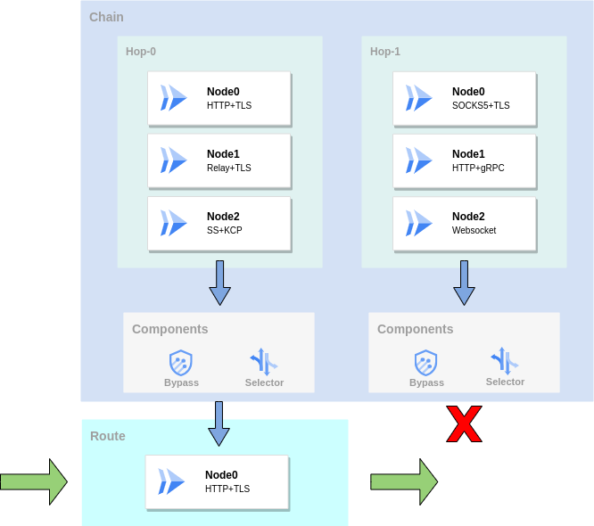
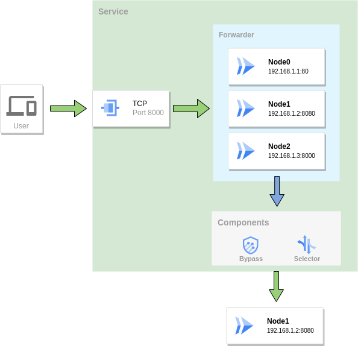

# 负载均衡

## 转发链

在GOST中，当流量到达服务(Service)后如果有转发链，则流量会通过转发链(Chain)转发到目标地址。转发链是由一个或多个层级的跳跃点(Hop)组成，每个跳跃点中可以包含一个或多个节点(Node)，节点之间是相互独立的。

在流量交给转发链之前，转发链需要确定一条转发路径。如果跳跃点中有多个节点，需要从这些节点中选出一个合格的节点作为路径的一个节点。GOST会依次在每个跳跃点上通过[分流器(Bypass)](bypass.md)和[选择器(Selector)](selector.md)选出一个节点，最终构成一条转发路径(Route)。

首先分流器会根据目标地址对跳跃点和节点进行筛选。对于跳跃点上的分流器，如果未通过测试则转发路径终止于此跳跃点且不包含此跳跃点。对节点上的分流器，如果未通过测试则此节点将被过滤掉。再根据选择器在剩余的节点中选出一个节点。

## 转发器

对于[端口转发](../tutorials/port-forwarding.md)服务，可以通过转发器(Forwarder)指定多个目标节点。当流量到达转发服务后，如果转发器中有多个目标节点，同样也需要在其中选出一个节点作为最终的转发目标。与转发链类似，转发器中也同样使用分流器和选择器来确定最终节点。

对于[反向代理](../tutorials/reverse-proxy.md)会稍微复杂一些，在以上节点过滤基础之上可以通过节点上的一些额外信息来过滤，例如对于HTTP流量可以通过节点上的主机名(host)或URL路径(path)信息来达到分流效果。